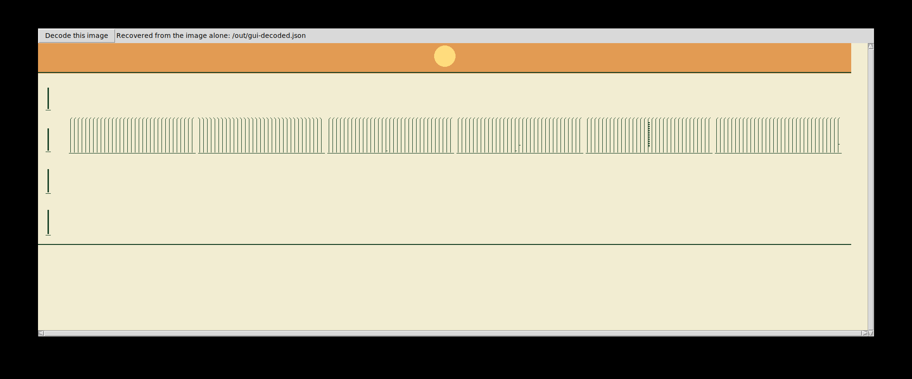

# Power Garden: executed native application in a Linux VM

On 9 September 2026, the existing standalone Power Garden application ran inside
a separate Linux guest under QEMU. Its native Tk window was displayed on an
Xvfb framebuffer inside that guest and captured from the actual X server. No
browser, HTML rendering, previous neural engine, or reconstructed window drawing
was used. The application source was unchanged at Git revision
`b3ec523e3a25eba16ba385f19432e112539e90e5`.



## Executed checks

The input is the existing six-value sample: positive zero, negative zero, one,
the next binary64 number above one, 0.1, and the smallest positive binary64
subnormal. Numeric comparisons used all 64 bits, including the sign of zero.

| Check in the guest | Result |
| --- | --- |
| Render complete 1712 × 432 PNG | Passed |
| Recover input using the independent fresh Node decoder | Exact |
| Invoke the native **Decode this image** button and compare its saved output | Exact |
| Capture actual 1920 × 800 X framebuffer | Passed |
| Compare complete displayed image region with native RGB pixels | Identical |
| Decode that image region in another fresh restricted Node process | Exact |

The test harness resized the native window to `1760x650+80+60`, invoked its real
button programmatically, and supplied an output filename in place of the save
dialog. It did not substitute another decode routine. The screenshot image
rectangle is `(x=80, y=91, width=1712, height=432)`. The full screenshot includes
ordinary application controls outside this rectangle; those controls are not
part of the renderer's reconstruction image. The native image and the screenshot
region exported to exactly the same PNG bytes:
`f07373f87d1c7b3d429c8e134019df133bc7ef2c4e34b66a8fa854f7732b9cd4`.

Each inverse process received only its public decoder file and one PNG. Node's
permission mode restricted its JavaScript file reads to those two files, with
empty standard input and a minimal environment. Source comparisons happened
after the decoder returned. The VM had no network interface and no shared host
filesystem mounts. Output files were transferred over its serial console with
SHA-256 checks; those hashes did not supply any information to the decoder.

## Runtime and evidence

| Item | Recorded value |
| --- | --- |
| Emulator | QEMU 8.2.2, Ubuntu package `1:8.2.2+ds-0ubuntu1.18` |
| CPU | x86_64, TCG software emulation, 2 virtual CPUs |
| Guest memory | 1536 MiB |
| Guest kernel | Linux `6.8.0-139-generic` |
| Guest Python / Pillow / Tk | 3.12.3 / 10.2.0 / 8.6 |
| Guest Node | 24.19.0 |
| Run 04 total host time | 98.92 seconds, including boot and shutdown |
| Run 04 measured guest application time | 56.12 seconds |
| Native image | 739,584 pixels; 3,989-byte lossless PNG |
| Complete screenshot | 1920 × 800; 11,697-byte lossless PNG |
| Initramfs | 86,928,926 bytes; 1,929 regular files |
| Kernel image | 15,059,336 bytes |

These timings describe software emulation in this particular environment, not
native desktop performance. `run-04/VM-Run.json`, `launch.json`, `qmp.json`, and
`serial.log` retain the detailed evidence. `guest-files.json` records every
regular guest file's SHA-256, and `packages.json` records exact package versions,
upstream package locations, and hashes. QEMU's monitor reported the machine
running and identified both guest CPUs.

This resolves the earlier **desktop/screenshot blocked** status for this exact
sample and display configuration. It does not extend the renderer's contract,
validate every input in the VM, or guarantee arbitrary screenshots, resizing,
JPEG, complete engine history, weights, or recovery of a source sentence. The
earlier 66-assertion suite was not rerun inside this VM. The rendered object is
the declared parameter geometry, with the same limitations as the original
Power Garden report.

## Replay the included guest

Install QEMU with x86 system emulation on the host, then extract the VM package
and run:

```sh
python3 replay.py
```

If QEMU is outside `PATH`:

```sh
python3 replay.py --qemu /absolute/path/to/qemu-system-x86_64
```

The included kernel and initramfs already contain Python, Tk, Pillow, Node, the
unchanged application, its sample, and the capture harness. The host needs no
Python packages beyond the standard library. QEMU boots the guest, runs the
native GUI on the guest's virtual display, captures it, and powers the guest
off. Open `Power-Garden-VM.png` from the newly printed replay directory in an
image viewer. This is an automated replay with a saved capture, not a live
remote-desktop session. Each replay uses a new output directory and reports a
failure if any of its four exactness checks fails. A separate replay of this
packaged entry point is recorded under `replay-check/` when present.

The package includes source for the renderer and all VM setup scripts. To
rebuild the initramfs, `prepare_packages.py` and `build_guest.py` document the
Ubuntu 24.04 staging procedure used here; the latter expects the original
repository beside its staging directory and the primary runtime's Node path.
Those build-time assumptions do not apply to replaying the supplied guest.

QEMU's official documentation describes [direct Linux kernel/initramfs
boot](https://www.qemu.org/docs/master/system/linuxboot.html) and [TCG software
emulation options](https://www.qemu.org/docs/master/system/invocation.html).
These are the mechanisms used here. Upstream Ubuntu packages are identified by
their complete download paths and versions in `packages.json`; the distribution
package copyright notices are included under `third-party-notices/`.

## Preserved unsuccessful attempts

- The remote browser backend failed before connection (`Connection closed`).
- A system-wide package installation failed at user/group and cache-directory
  operations. Packages were instead downloaded, checked against the local APT
  metadata, and extracted into a project-specific staging directory.
- Run 01: QEMU could not create a host Unix control socket. The subsequent
  launcher used ordinary process pipes for QMP instead.
- Run 02: QEMU could not find its locally extracted TCG module. Specifying its
  local module directory resolved that packaging issue.
- Run 03: the guest rendered and independently decoded the sample exactly, but
  its GUI lacked Ubuntu's separately packaged `PIL.ImageTk` component. Its error,
  outputs, guest manifest, and harness are retained.
- Run 04: all listed checks passed after adding that component. Fontconfig
  cache-directory warnings and nonfatal extended-keyboard-symbol warnings are
  retained in the serial log; they did not change the captured image pixels.

The successful guest reports exit zero. Earlier failure evidence remains
separate and is not counted as a pass.
